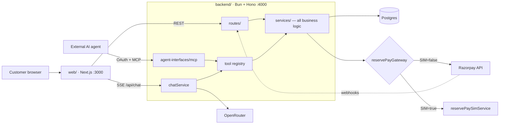

# Fresh Cart — agentic commerce on Razorpay

A working grocery store that humans use through a normal website, and AI agents transact with
over MCP + OAuth — same business logic underneath, no special integration on the agent side.

Payments run on Razorpay. Agent-initiated purchases use **UPI Reserve Pay (SBMD)**: block funds
once with one UPI PIN approval, then debit that block headlessly. A chat panel or an external
agent can't drive a Razorpay Checkout popup, which is why that rail exists.

- `backend/` — Bun + Hono. Services, REST, MCP server, webhooks. Port 4000.
- `web/` — Next.js. Storefront, `/admin` dashboard, chat panel. Port 3000.

## Architecture



Both agent surfaces call the same tool registry, which calls the same `services/` the REST routes
do. No business logic in a route or a tool handler.

## Setup

Needs [Bun](https://bun.com) 1.3+ and a Postgres database.

### 1. Backend

```bash
cd backend
bun install
cp .env.example .env      # then fill it in — see below
bun run db:migrate
bun run db:seed           # categories + products, safe to re-run
bun run dev               # http://localhost:4000
```

Env is validated at boot — a missing key exits the process with the name of what's missing, it
won't surface as a 500 later.

**Must be set or it won't boot:**

| Key | Where from |
|---|---|
| `DATABASE_URL` | your Postgres |
| `JWT_SECRET` | `openssl rand -hex 32` |
| `ADMIN_PASSWORD` | pick one — this is the `/admin` login |
| `ADMIN_JWT_SECRET` | `openssl rand -hex 32`, different from `JWT_SECRET` |
| `RAZORPAY_KEY_ID` / `RAZORPAY_KEY_SECRET` | [dashboard test keys](https://dashboard.razorpay.com/app/keys) |
| `RAZORPAY_WEBHOOK_SECRET` | Razorpay dashboard, webhook settings |
| `OPENROUTER_API_KEY` | [openrouter.ai/keys](https://openrouter.ai/keys) — powers the chat agent |

**Optional:** `SARVAM_API_KEY` (voice chat — unset just hides the mic, `/api/voice/*` answers 503),
`OPENROUTER_MODEL` / `OPENROUTER_FALLBACK_MODEL`, `PORT`, `CORS_ORIGIN`, `DEBUG_LOGS`,
`RAZORPAY_DEBUG`. Reserve Pay and OAuth flags below.

### 2. Web

```bash
cd web
bun install
cp .env.example .env.local   # NEXT_PUBLIC_API_BASE_URL=http://localhost:4000
bun run dev                  # http://localhost:3000
```

Holds no data of its own. Backend down = error states, not a catalog.

## Razorpay: production vs simulator

One flag, `RESERVE_PAY_SIM` in `backend/.env`.

| | `RESERVE_PAY_SIM=false` (production) | `RESERVE_PAY_SIM=true` |
|---|---|---|
| Card/UPI checkout (`/checkout/initiate` → Checkout.js → `/verify`) | real Razorpay | **still real** — unaffected by the flag |
| Reserve Pay rail | 502 `PAYMENT_GATEWAY_ERROR` on this account, see below | works end to end |
| Guards, reservations, audit rows, status mapping | real | identical code path |
| Signatures | real | real — HMAC with the same `RAZORPAY_KEY_SECRET` / `RAZORPAY_WEBHOOK_SECRET` |
| Ids | Razorpay's | carry a `_sim_` segment |
| `/api/reserve-pay/sim/*` controls | not registered | approve now, arm a decline, set token status, read state |

`services/reservePayGateway.ts` picks real or simulated at import. Only the eight gateway calls
are swapped — everything that makes the rail *bounded* runs either way.

Simulator knobs, all optional: `RESERVE_PAY_SIM_APPROVAL_DELAY_MS` (default 20000 — how long a
block stays `pending`; 0 confirms instantly), `RESERVE_PAY_SIM_WEBHOOKS` (default on — replays the
webhook Razorpay would have sent, correctly signed, so the async reconciliation path runs and not
just polling), `RESERVE_PAY_SIM_WEBHOOK_DELAY_MS` (default 500).

Separately, `RESERVE_PAY_TEST_DEBIT_ROUTE=true` registers `POST /api/reserve-pay/mandates/debit`,
a harness that charges the caller's block with no order attached. Off by default in both modes —
it moves real money for any authenticated caller.

**Boot refuses `RESERVE_PAY_SIM=true` against an `rzp_live_` key.** The simulator reports debits
as captured without moving money; against live keys that's a lie about real funds.

### Why the simulator exists

Razorpay hasn't provisioned the **server-to-server payment API** on this account.
`POST /v1/payments/create/json` answers `400 BAD_REQUEST_ERROR "The requested URL was not found on
the server."` for any payment. Probed directly with curl, not just through our code:

| Call | Result |
|---|---|
| `POST /v1/customers` | 200 |
| `POST /v1/orders` with `token.type: single_block_multiple_debit` | 200 |
| `POST /v1/payments/create/ajax` | 401 — auth reached, so the 400s aren't an auth problem |
| `POST /v1/payments/create/json` | **400 "URL not found"** |
| `POST /v1/payments/create/upi`, `/validate/vpa` | **400** same |

`GET /v1/methods` reports `upi: true`, `recurring.upi: true` — UPI as a *method* is on, the S2S
*API* is off. Separate entitlements; only the second blocks us.

**To go to production:** ask Razorpay support to enable the **S2S JSON API**
(`/payments/create/json`) and `save_vpa`, then drop `RESERVE_PAY_SIM`. No real Razorpay call was
removed or edited to build the simulator.

One narrowing: `POST /payments/create/recurring` *is* provisioned and returns exactly the shape
`createReservePayDebitPayment` expects — so the **debit** half has a working endpoint. The
**authorisation** half doesn't, and no authorisation means no token to spend.

## ngrok — needed twice

Both need a public https origin:

1. **Webhooks** — point the Razorpay dashboard webhook at `https://<host>/webhooks/razorpay`.
2. **Remote MCP clients** (Claude Desktop etc.) — set `OAUTH_ISSUER_URL` to the ngrok origin.

```bash
ngrok http 4000
# set OAUTH_ISSUER_URL=https://<host> in backend/.env
# RESTART the backend
```

**Restart is not optional.** `.env` is read once at boot and `bun --watch` doesn't watch it.

**`OAUTH_ISSUER_URL` is the whole game for MCP.** Every URL in both discovery documents is built
from it; nothing derives them from the incoming request. Left on localhost behind a tunnel, the
client is told to register at `http://localhost:4000/oauth/register`, can't reach it, and reports
a sign-in failure — while your log shows discovery succeeding and then no `POST /oauth/register`.
That missing line is the signature of this bug.

Leave `PUBLIC_APP_URL` on localhost — `/oauth/authorize` redirects to `web/`'s `/agent-connect`
page in your own browser, and `web/` must be running on :3000 for the approval step to render.

A free ngrok URL changes every restart: new URL → new `OAUTH_ISSUER_URL` → backend restart →
re-add the connector. A reserved domain removes the loop.

## Next

- **`backend/API.md`** — every route, request/response shape and error code. Read this to
  integrate, not the source.
- **`claude.md`** — project rules for AI agents working on this repo.
- **`backend/CLAUDE.md`**, **`web/AGENTS.md`** — per-project conventions.
